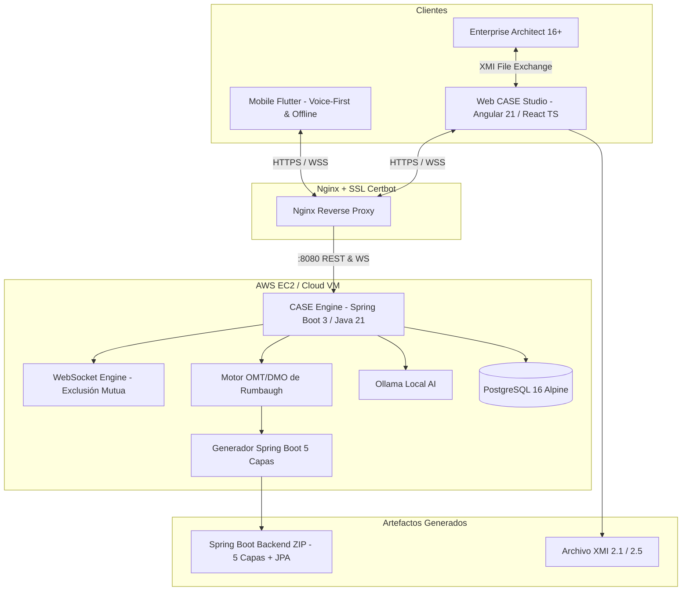
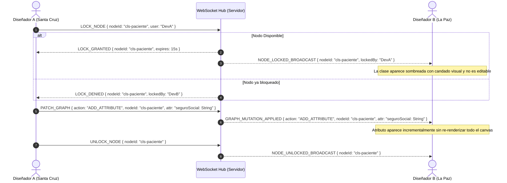
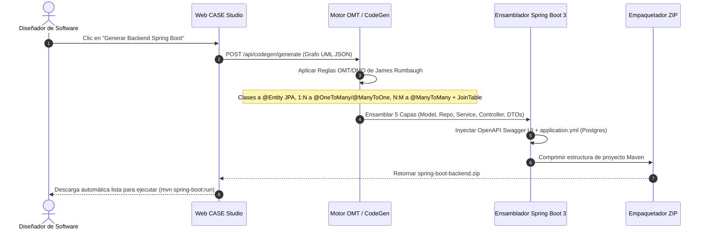

# Arquitectura del Sistema — CASE Studio AI

Documento formal de arquitectura de software, patrones de diseño, decisiones técnicas y flujos de secuencia.

---

## 1. Diagrama General de Arquitectura

---

## 2. Flujo de Sincronización Colaborativa y Exclusión Mutua

El canvas colaborativo implementa exclusión mutua basada en tokens de bloqueo temporal para garantizar que dos diseñadores no editen los atributos o relaciones de la misma clase simultáneamente:

---

## 3. Flujo de Generación de Backend (Reglas OMT/DMO de Rumbaugh)

---

## 4. Decisiones Arquitectónicas (Trade-Offs)

| Decisión | Alternativa Evaluada | Justificación |
|---|---|---|
| **Spring Boot 3 (Java 21) en Backend Generado** | Node.js / Express, Django | Exigencia obligatoria del docente. Spring Data JPA y Hibernate proveen la abstracción ORM ideal para mapear reglas OMT/DMO a PostgreSQL automáticamente (`ddl-auto: update`). |
| **Monorepo Unificado** | Repositorios separados | Permite atomicidad en commits, facilidad de despliegue con un único `docker-compose.yml`, sincronización entre cliente Web, Backend y Móvil. |
| **Exclusión Mutua con Heartbeat** | Pessimistic Locking estricto en DB | Los WebSockets con leases de 15 segundos y heartbeats garantizan latencia inferior a 50ms y auto-recuperación si un usuario pierde la conexión. |
| **Parches de Grafo Incrementales** | Re-renderizado total con SVG/Canvas | Evita el consumo desmedido de CPU/GPU en navegadores web remotos exigido expresamente por el docente en la clase 1. |
| **Flutter con Arquitectura Offline-First** | React Native, PWA | Flutter compila a código nativo en ARM, ofrece acceso a motores locales de inferencia (IA on-device) y almacenamiento SQLite local con sincronización transaccional al conectarse con el backend. |
