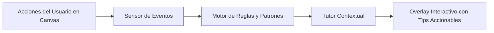

# Mecanismo de Aprendizaje para el Usuario: Agente Tutor Interactivo

**Requisito de la Parte 3 de la Documentación**: Especificación formal del sistema de asistencia activa.

---

## 1. Filosofía de Diseño

Frente a la ineficacia pedagógica de manuales estáticos de cientos de páginas o tutoriales en video de larga duración, **CASE Studio AI integra un Agente Tutor Inteligente en tiempo real**.

El agente opera en segundo plano dentro de la interfaz web, monitoreando el flujo de interacción del diseñador de software. Cuando detecta vacilaciones, errores conceptuales (ej. asociaciones reflexivas sin cardinalidad, herencia múltiple prohibida en mapeo relacional o atributos sin tipo), interviene de forma instantánea (*"¡flaz, flaz, flaz!"*) mediante burbujas contextuales y sugerencias accionables.

---

## 2. Arquitectura del Agente Tutor

### 2.1 Capacidades Principales:
1. **Onboarding Guiado Interactivo**: Recorrido de 4 pasos al iniciar el sistema (Creación de clase, mutación por voz, exportación XMI y generación de Backend).
2. **Validación Semántica UML en Caliente**: Alerta temprana si una relación no cumple las reglas de multiplicidad o si una clave foránea generará un ciclo en PostgreSQL.
3. **Sugerencias de Comandos de Voz**: Muestra en tiempo real la transcripción fonética y cómo estructurar el comando para mutar el grafo sin usar el teclado.
